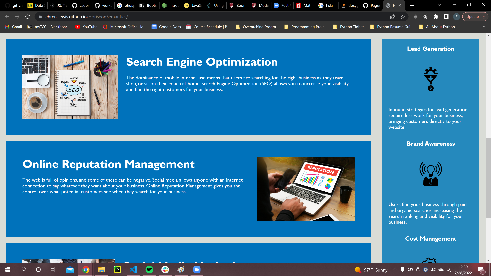
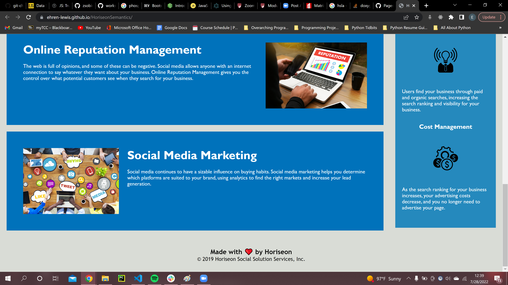

HoriseonSemantics

Author: Ehren Lewis

This application is the landing paged for the company Horiseon.
I built this project because Horiseon Services wanted to outsource
the refactorization of their landing page to a freelance developer,
and I partnered with them because I stand by their company values.

I used html and css as the technolgy, and only these because their website didn'trequire dynamic browsing. 

The challenges I faced when refactoring the codewas insuring
 there were no typos when trying to add css selectors to the html elements.

I hope in the future to further refactor the code to make sure there is no repition, or possibly add some dynamic features to the website.

I learned how to refactor code to make it more concise, as well as
how to navigate a codebase that someone else has created.

Known bugs: There are some issues with the responsiveness on smaller screens

link to live site: https://ehren-lewis.github.io/HoriseonSemantics/
link to repository: https://github.com/Ehren-Lewis/HoriseonSemantics

Installation process:

1. Navigate to the code repository
2. Press the green code button, located near the about section
3. Copy either the HTTPS, Git CLI, download the zip, open with GitHub desktop, or copy the SSH link.
4. Depending on download method, use Git, executable, or the desktop application to open the content files
5. All of the content of the reopistory will be available after completion of the previous state.

Usage:

Credits:

Horiseon Social Solution Services, Inc.
Trilogy Education Services.